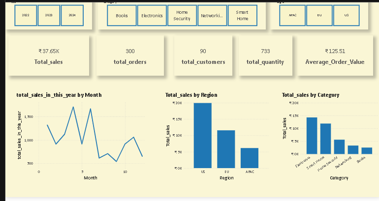

# 🛍️ Retail Sales Analysis – Power BI Dashboard

## 📌 Project Objective
Analyze retail sales data to uncover insights about revenue trends, customer behavior, and product performance using Power BI.

## 🧰 Tools Used
- Power BI
- DAX (Data Analysis Expressions)
- Power Query
- Microsoft Excel (Raw Data)

## 📈 Key Business Insights
- 🔹 Year-over-Year Revenue Growth
- 🔹 Top 10 Products by Sales Volume
- 🔹 Most Valuable Customers (LTV)
- 🔹 Region-wise and Category-wise Sales Breakdown

## 🖼️ Report Preview

> 📝 Note: More dashboard views are available in the **Screenshots/** folder.

## 📂 Repository Structure

PowerBI-Retail-Sales-Analysis/
├── Data/ ← Raw dataset (CSV/XLSX)
├── Report/ ← Power BI .pbix file
├── Screenshots/ ← Dashboard previews (PNG)
└── README.md ← Project documentation

## 🚀 How to View the Report
1. Download the `.pbix` file from `/Report`
2. Open it in Power BI Desktop
3. Explore dashboards and DAX logic

## 🔄 Future Enhancements
- Integrate SQL-based live data connection
- Interactive filter-based storytelling

## 👤 Author
[C.V.S.NEERAJ KUMAR]  
[linkedin.com/in/neeraj-kumar-1376a7163] | Neeraj_DA | cvsneeraj@gmail.com
